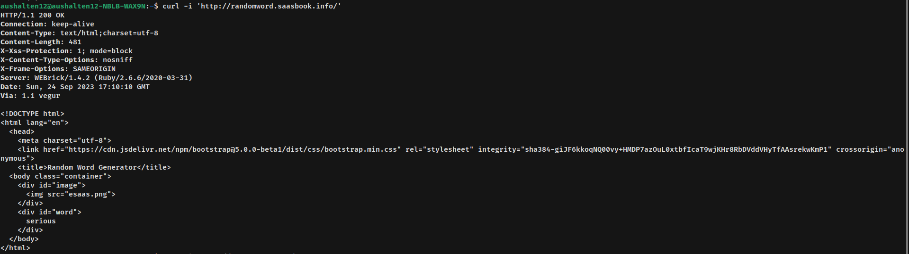

# Respuestas de la Actividad HTTP - Uri

---

## Comando Curl

Del sitio web generador de palabras aleatorias, podemos ver una imagen quese mantiene estática y una palabra que cambia cada vez que cargas la págima.

Usamos el comando `curl 'http://randomword.saasbook.info/'` en la terminal y muestra como resultado un código HTML

Para guardarlo en un archivo se debe escribir `curl 'http://randomword.saasbook.info/' > PrimerCurl.html` y se creare un archivo HTML con el código que aparecio antes

### Diferencias entre el sitio web y el archivo HTML

Al abrir el archivo HTML en el navegador, la imagen no aparece,ya que no la encuentra en el servidor, a diferencia que al abrir el enlace. Otra diferencia es que al cargarlo nuevamente no cambia la palabra. Es decir, que este es un archivo estático.

## NetCat

Iniciamos el falso servidor el puerto 8081 con el comando `nc -l 8081`.

Para acceder a nuestro falso servidor debemos de ingresar `curl 'http://localhost:8081/'`

En la terminal en la que coloque `nc -l 8081` aparecio esto al momento de ejecutar el comando *curl* en la otra terminal.

En esta aparece el metodo de peticion que en este caso es con el método GET, el host que es localhost en el puerto 8081, User-Agent que es curl, el comando por el cual se accedio a la petición,además de la versión y Accept como un \*/\*. Le doy un enter y aparece en la pestaña en el que se uso el comando *curl*, esto:

Al colocar `curl -i 'http://randomword.saasbook.info/'`se obtiene esto :

El código de respuesta en este caso es de 200 lo cual indica que la solicitud ha tenido exito. La version de HTTP es la 1.1. Además de informar que la conexión is *keept-alive* que indica la forma de conexión,también el tipo del contenido, el servidor desde que se envia la respuesta, y por ultimo todo el codigo HTML

En el encabezado hay un campo Content-Type, que en este caso y en la mayoria de sitios web aparece **text/html** por lo que son archivos de texto HTML, codificados mediante **charset=utf-8**

## ¿Qué sucede cuando falla un HTTP request?

Al ingresar en la terminal `curl -i *URL inexistente*` se obtuvo el código 301,. Y al ingresarle una *URL* que necesita autenticación retorno el código 302

La principal diferencia entre los encabezados `4xx` y el `5xx` es que el primero son errores del cliente,mayormente el error esta en que el servidor no puede interpretar la solicitud o no tiene los permisos adecuados; y el segundo son errores del servidor, este no puede soportar ni manejar la solicitud enviada por el cliente.  

## ¿Qué es un cuerpo de Request?

Se creo formulario.html y se abrio en el navegador

Para llegar al servidor falso de debe cambiar en el campo *action* del *form* a `http://localhost:8081/` para obtener lo siguiente en la terminal que se inicio el falso servidor

Al acabar, se corta la conexión.

Para presentar al servidor la información que ingresó en el formulario, los datos que ingresa el usuario se enviarán al servidor que se agregue al campo *action* que en este caso es el `localhost:8081` y de ahí frameworks como Sinatra o Rails, escucha la solicitud y acceden a los datos mediante objetos. Ya luego lo validan, y los almacenan en una base de datos.

* Si se hace una peticion con los parametros URI obtenidos, en la terminal que se inicio el servidor va a aparecer un método `GET` con dichos parametros URI y adicionalmente una cookie
* Si cambias el nombre de las propiedades del formulario cambiaria los parametros URI, al cambiar *Email* por *Username* obtuve `username=josepm&password=root&secret_info=secret_value&login=Log+In%21`  
* Si, se puede tener más de un botón submit, para saber al cual se le hizo click, en la terminal en la ultima linea aparece algo como esto `email=jose%40jose.com&password=jose&secret_info=secret_value&registrate=Registrate%21` en *registrate* que es el **name** del *submit* se igual a su **value** que es *Registrate*, de esta forma se sabe a que botón se hizo click
* Con el metodo **GET** al enviar los datos, a diferencia que con el método **POST** se cargaba una pestaña con `localhost:8081` sin los datos, sí se muestran los datos ingresados. Es decir, los datos son visibles con GET en la URL y con POST no.
* Al colorcarle en el campo *method* los métodos `PUT, DELETE O PATCH` en la terminal aparece el método *GET* y al investigar encontré que los formularios de HTML solo aceptan los métodos `GET y POST`

## HTTP sin estados y cookies

La diferencia es que en `http://esaas-cookie-demo.herokuapp.com` no aparece el campo **Set-Cookie** y en `http://esaas-cookie-demo.herokuapp.com/login` si aparece ese campo.

Al agregarle el `?logged_in=true`, lo que aparece en el navegador es **Logged in: true**, sin embargo en la terminal al usar el comando *curl*, retorna lo siguiente

Esto ocurre porque los cookies deben de ser almacendos en el navegador

Al guardar los cookies en un archivo .txt e incluirlas cuando se abra la página. Al hacer eso al hacer `curl -v -b cookies.txt http://esaas-cookie-demo.herokuapp.com/`, aparece *Logged in; true*.

Para evitar la inseguridad de que un usuario malicioso acceda con un cookie manipulado a una cuenta o un sitio no autorizado, para eso esta el protocolo HTTPS que cifra estos cookies para darle seguridad a diferencia de HTTP, por eso se usa más HTTPS. Además,cuando inicias sesión en una página se te asigna un token y estos se guardan en las cookies.

**FIN**

